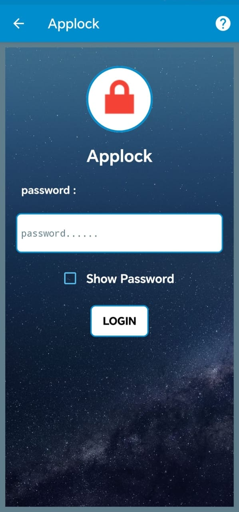
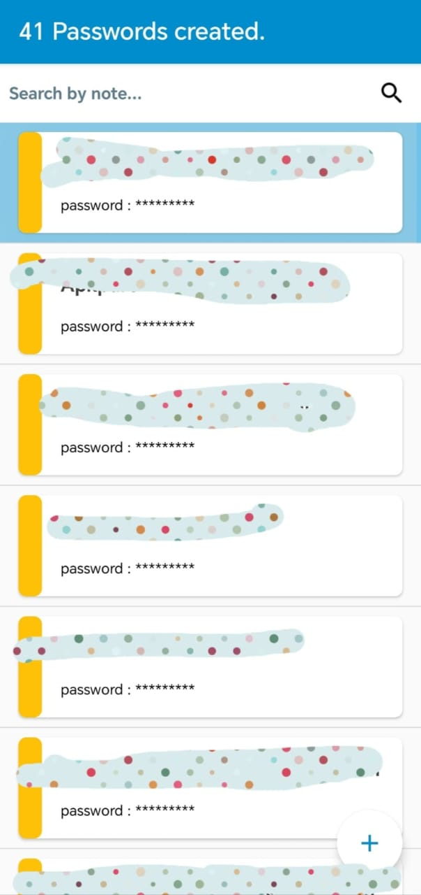
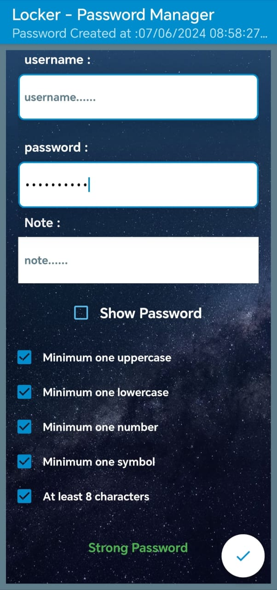
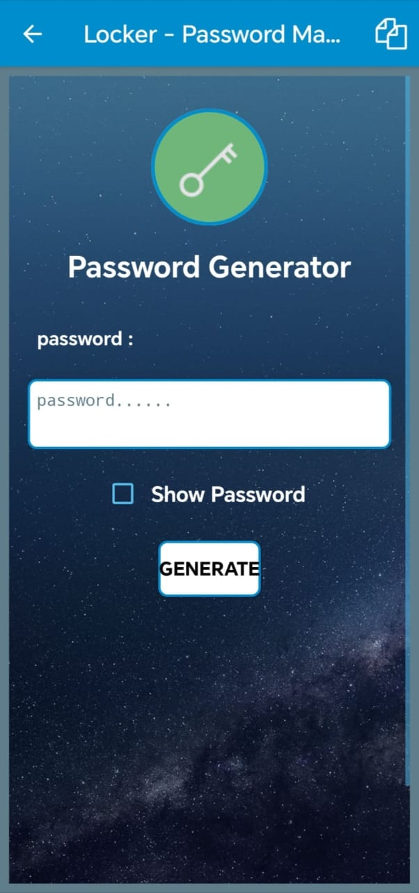
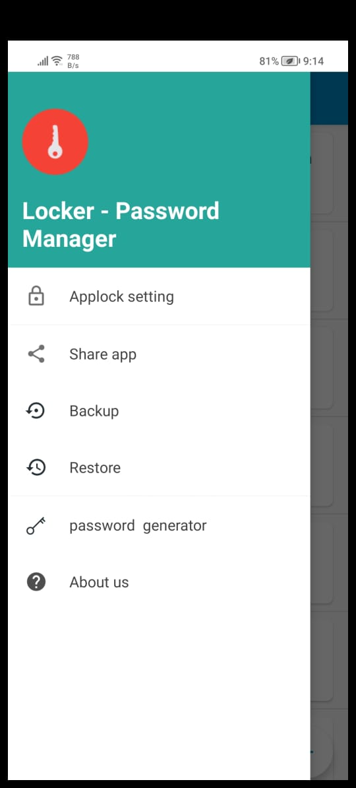

# 🔐 Locker – Password Manager  
A free, secure, and lightweight offline password manager for Android.

---

## 📖 Overview

**Locker – Password Manager** is a powerful and privacy-focused Android application designed to help users securely store, manage, and protect their passwords. With AES encryption, offline access, and a user-friendly interface, this app ensures that your credentials stay safe — and always within reach.

---

## ✨ Key Features

- 🔐 Securely store and manage passwords  
- 🔒 Built-in app lock system for extra protection  
- 🧠 Generate strong, safe passwords automatically  
- 💾 Backup and restore password data  
- 📋 Easily copy or share passwords when needed  
- 🧪 Test the strength of your existing passwords  
- ⚡ Quick access to stored credentials  
- 📲 Simple, clean, and beginner-friendly interface  
- 📴 Works fully offline  
- 🚫 No ads — fully private and distraction-free  

---

## 🔧 Special Functionalities & Architecture

- 🛡️ **AES encryption** to securely store sensitive data  
- 🧠 Built with **MVVM architecture** for scalability and maintainability  
- 📴 Works **completely offline** — no cloud or server access  
- 🔐 Includes **app-level lock** to protect unauthorized access  

---

## 🛠️ Tech Stack

- **Language:** Java  
- **IDE:** Android Studio  
- **Encryption:** AES (Advanced Encryption Standard)  
- **Architecture:** MVVM  
- **Platform:** Android  

---

## 📸 Screenshots

 Applock | Password List | Add Password | Password Generator | Settings |
|----------------|--------------|------------|------------------|----------|
| |  |  |  |  |

---

## 🛡️ Important Notice

⚠️ **Security Notice:**  
Only screenshots and a partial portion of the source code are included in this repository for privacy and security reasons.

To access the full application or collaborate, please contact the developer directly:

📧 **mkt9319@gmail.com**

---

## 🙋 Contact

**Developer:** Minhajul Khan  
📧 Email: mkt9319@gmail.com
---

## 📄 License

This project is licensed under the [MIT License](LICENSE).  
Feel free to explore, fork, or contribute!

